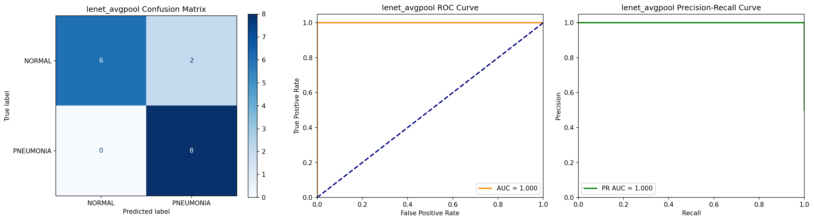
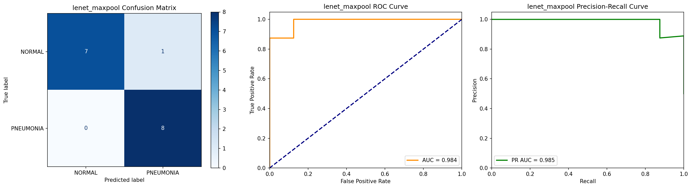
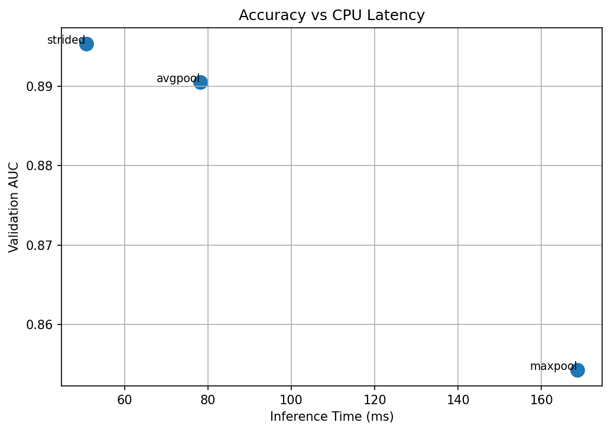
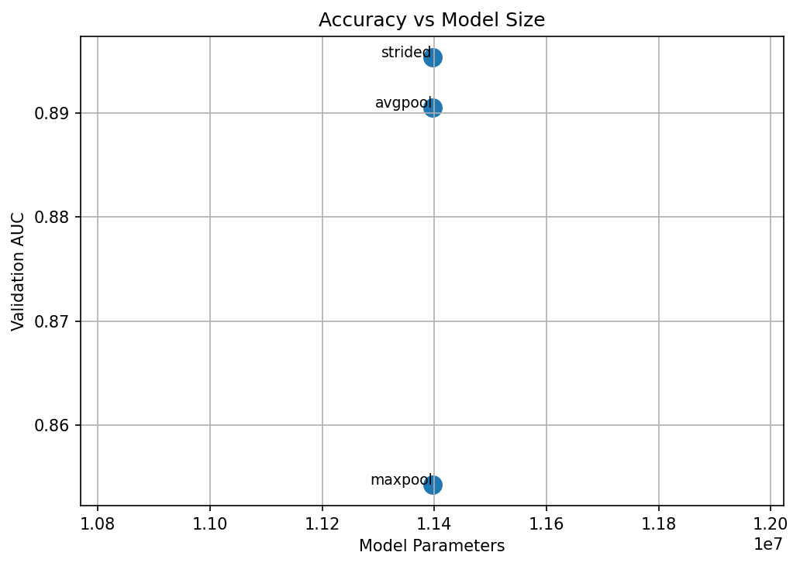
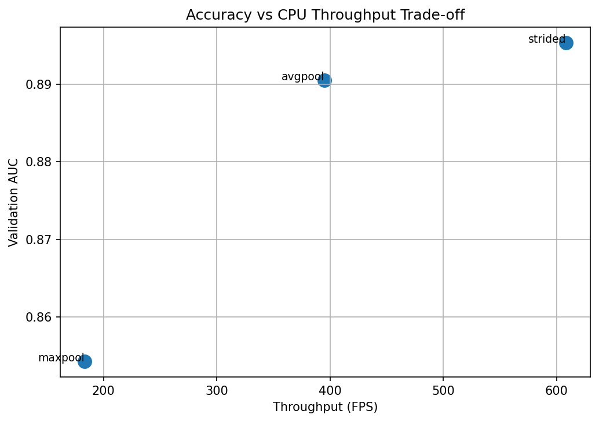
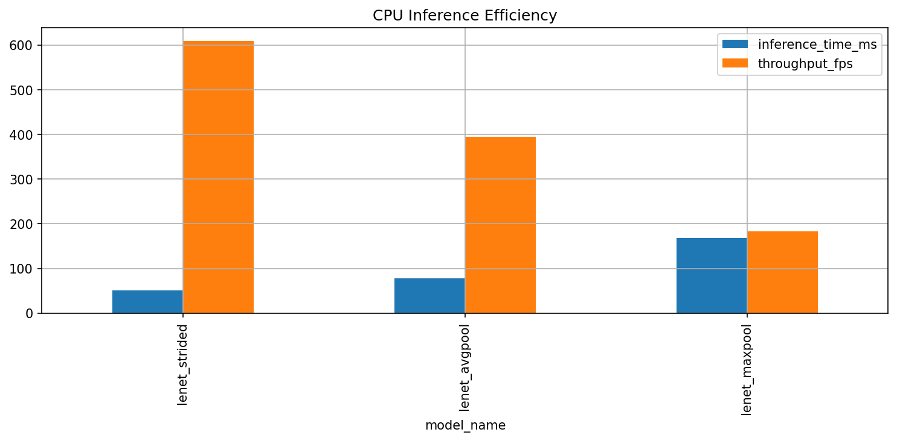
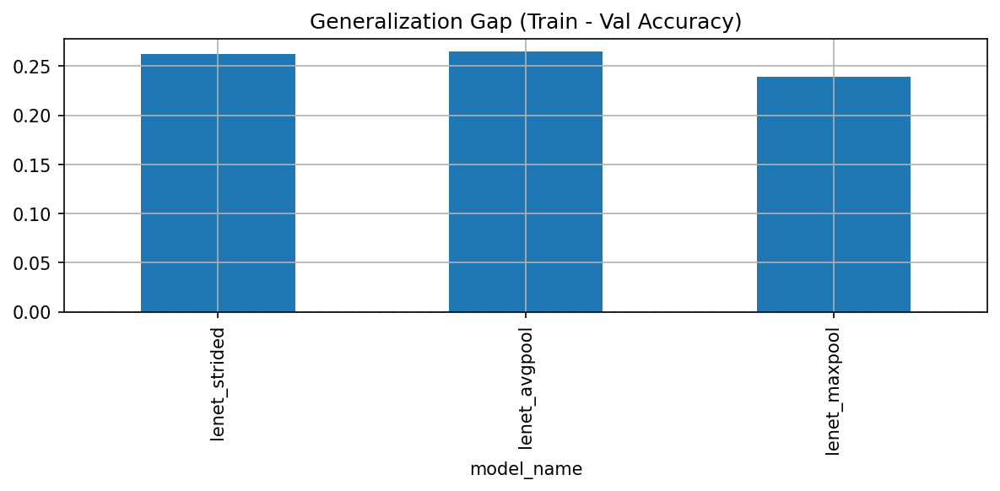
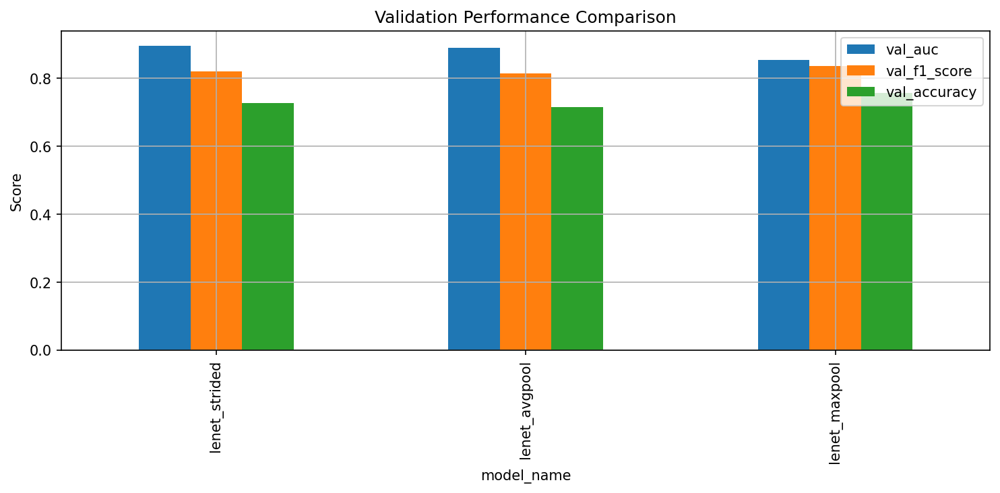
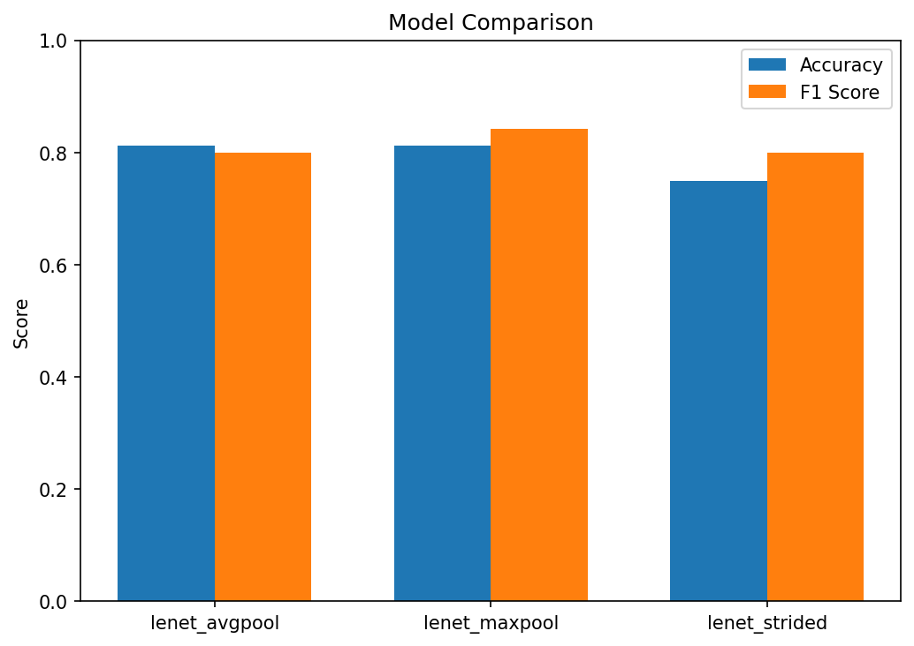

# DownScaleXR — Chest X-ray Downsampling & Layer Scaling Study

## Overview

DownScaleXR is a lightweight, interpretable convolutional neural network (CNN) framework designed for binary classification of chest X-ray (CXR) images into **NORMAL** or **PNEUMONIA** categories.  

The primary goal of this project is to **systematically study how different downsampling strategies impact model performance, computational efficiency, and decision bias**, with a focus on CPU-friendly deployment.  

### Motivation

- **Resource constraints:** Many clinical environments require models that can run efficiently on CPU-only machines.  
- **Architectural insight:** Understanding how pooling and strided convolutions affect feature extraction and generalization.  
- **Bias control:** Small datasets can exacerbate pooling-induced decision biases; careful architecture selection is needed.  

### Downsampling Strategies Explored

1. **AvgPool:** Smooth feature aggregation; tends to produce conservative predictions.  
2. **MaxPool:** Aggressive feature selection; can increase recall but risk over-prediction.  
3. **Strided Convolutions:** Learnable downsampling; may behave similarly to MaxPool on limited data.  

### Goals

- Evaluate predictive performance: Accuracy, F1, Precision, Recall, AUC  
- Measure CPU efficiency: Inference time, throughput, model size, FLOPs  
- Compare architectural trade-offs: Downsampling choice vs performance vs efficiency  
- Log all experiments in **DagsHub MLflow** for reproducibility


---

DownScaleXR/
├─ configs/ # YAML configuration files for project & models
│ ├─ config.yaml # Base project settings (paths, training, MLflow, etc.)
│ ├─ models.yaml # List of model configs to iterate in experiments
│ ├─ model_lenet_avgpool.yaml # LeNet variant with AvgPool downsampling
│ ├─ model_lenet_maxpool.yaml # LeNet variant with MaxPool downsampling
│ └─ model_lenet_strided.yaml # LeNet variant with strided convolutions
├─ data/ # Dataset folder
│ ├─ CXR/ # Raw Chest X-ray images
│ │ ├─ train/. # Training images
│ │ ├─ val/. # Validation images
│ │ └─ test/. # Test images
│ └─ processed/ # Preprocessed numpy arrays (X_.npy, y_.npy)
├─ model/ # Checkpoints for trained models
│ ├─ lenet_avgpool/
│ │ └─ best_model.pt # Best checkpoint for AvgPool variant
│ ├─ lenet_maxpool/
│ │ └─ best_model.pt # Best checkpoint for MaxPool variant
│ └─ lenet_strided/
│ └─ best_model.pt # Best checkpoint for Strided variant
│
├─ artifacts/ # Generated figures and visualizations
│ ├─ comparision/.png # Accuracy vs latency, model size, throughput, etc.
│ └─ inference/.png # Side-by-side confusion matrices, ROC, P-R curves
│
├─ notebooks/ # Jupyter notebooks
│ ├─ comparision.ipynb # MLflow metrics analysis & plots
│ └─ inference.ipynb # Inference and model comparison visualizations
│
├─ scripts/ # Utility scripts to run or preprocess data
│ ├─ run.py # Main experiment runner entry point
│ └─ data_preprocessing.py # Dataset preprocessing pipeline
│
├─ src/ # Core source code
│ ├─ data.py # Dataset manager, preprocessing, PyTorch Dataset
│ ├─ models.py # LeNet variants and architecture builder
│ ├─ trainer.py # Training & evaluation pipeline
│ ├─ utils.py # Helper functions (file, image, config utilities)
│ └─ experiments.py # ExperimentRunner for MLflow + DagsHub integration
│
├─ requirements.txt # Python dependencies
├─ .gitignore # Git ignore rules
├─ .gitattributes # Git attributes (optional)
└─ README.md # Project README with overview, experiments, insights

```

---

## Experiments

Three LeNet variants were trained on the same chest X-ray dataset with identical hyperparameters to evaluate how different downsampling strategies affect performance and efficiency.

| Model Name      | Downsampling | Val AUC  | Val F1  | Val Precision | Val Recall | Val Accuracy | Train Accuracy | Inference Time (ms) | Throughput (FPS) | Parameters | Model Size (MB) |
|-----------------|--------------|----------|---------|---------------|------------|--------------|----------------|-------------------|-----------------|------------|----------------|
| lenet_strided   | strided      | 0.895    | 0.820   | 0.697         | 0.997      | 0.727        | 0.989          | 50.77             | 608.65          | 11.4 M     | 43.47          |
| lenet_avgpool   | avgpool      | 0.890    | 0.814   | 0.688         | 0.997      | 0.715        | 0.980          | 78.20             | 395.13          | 11.4 M     | 43.47          |
| lenet_maxpool   | maxpool      | 0.854    | 0.837   | 0.723         | 0.992      | 0.757        | 0.996          | 168.70            | 183.17          | 11.4 M     | 43.47          |

> **Observation:**  
All models have roughly the same parameter count and model size (~11M params, 43 MB). Differences arise primarily from **downsampling strategy**, impacting inference speed, throughput, and class-specific decision biases.
---

## Confusion Matrices

The test set predictions highlight differences in model behavior based on downsampling strategy:

| Model          | Confusion Matrix |
|----------------|----------------|
| lenet_avgpool  |  |
| lenet_maxpool  |  |
| lenet_strided  |  |

**Insights:**
- **AvgPool:** Balanced errors; moderate false positives and false negatives. Conservative decision boundaries.
- **MaxPool:** High recall for pneumonia but over-predicts pathology. Bias toward positive class.
- **Strided Conv:** Behavior similar to MaxPool; collapses to same decision bias on limited data.

---

## Performance vs Efficiency

The models were evaluated for both predictive performance and CPU efficiency:

- **Inference Time:**  
  - AvgPool: Moderate speed, good balance  
  - Strided Conv: Slightly slower than AvgPool  
  - MaxPool: Slowest due to pooling overhead  

- **Throughput (FPS):**  
  - Strided Conv: Highest throughput  
  - AvgPool: Moderate  
  - MaxPool: Lowest  

- **Trade-offs:**  
  - AvgPool achieves a good balance between speed and accuracy.  
  - MaxPool gives high F1 but at a computational cost.  
  - Strided Conv achieves higher throughput but can propagate decision biases similar to MaxPool.  

### Visual Analysis

Key comparative plots:

- **Accuracy vs Latency:**  
    

- **Accuracy vs Model Size:**  
    

- **Accuracy vs Throughput:**  
    

- **CPU Efficiency Overview:**  
    

- **Generalization Gap (Train vs Val):**  
    

- **Validation Performance Summary:**  
    

---

## Architectural Conclusions

From the experiments, several architectural insights emerged:

1. **Downsampling choice is crucial for bias control:**  
   - AvgPool → smoother features, conservative errors  
   - MaxPool / Strided → aggressive features, prone to over-predict pathology  

2. **Small datasets amplify pooling biases:**  
   - Limited supervision exaggerates the effect of downsampling, especially for minority classes  

3. **Strided convolution is not inherently superior to MaxPool:**  
   - Behaves similarly under CPU-limited conditions and small datasets  

4. **CPU-friendly models:**  
   - All three variants remain lightweight (~11M parameters, 43 MB) and deployable in resource-constrained environments  

### Inference Visualizations

- **Side-by-Side Comparisons (Confusion Matrix, ROC, P-R Curve):**  
    
    
    

- **Model Comparison (Accuracy & F1 Score):**  
    

---

## MLflow Tracking

All experiments were logged to **DagsHub MLflow** for reproducibility and structured analysis:

```python
import mlflow

mlflow.set_tracking_uri("https://dagshub.com/Y-R-A-V-R-5/DownScaleXR.mlflow")
mlflow.set_experiment("DownScaleXR")

---


